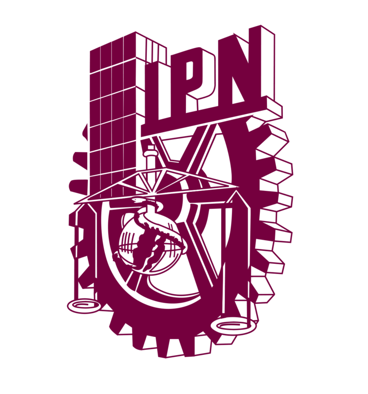

  
  
  <h1 style="font-size: 24px;">ESCUELA SUPERIOR DE CÓMPUTO</h1>
  

  <h1>Servidor TCP implementado en C++ para juego de Buscaminas.</h1>

  <h2>Aplicaciones para comunicaciones en red</h2>

  <h2>Profesor: </h2>
  
Axel Ernesto Moreno Cervantes

  <h2>Elaboró:</h2>
  
Serge Eduardo Martínez Ramírez

  
Alejandra Villegas Gómez

  <h2>Grupo: 6CM1 </h2>

